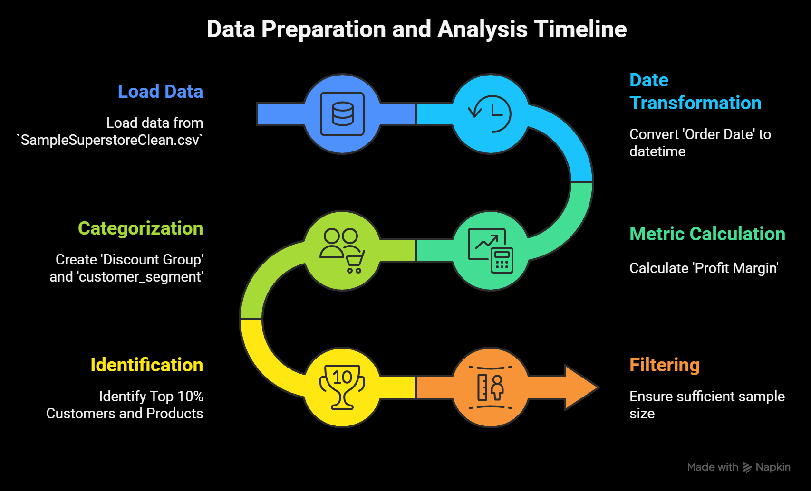
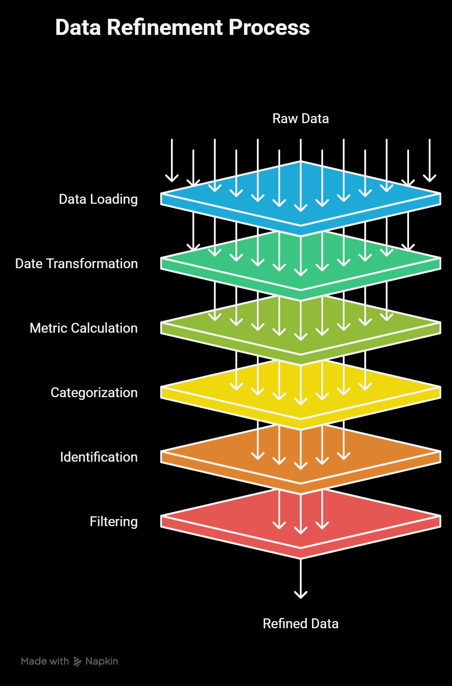
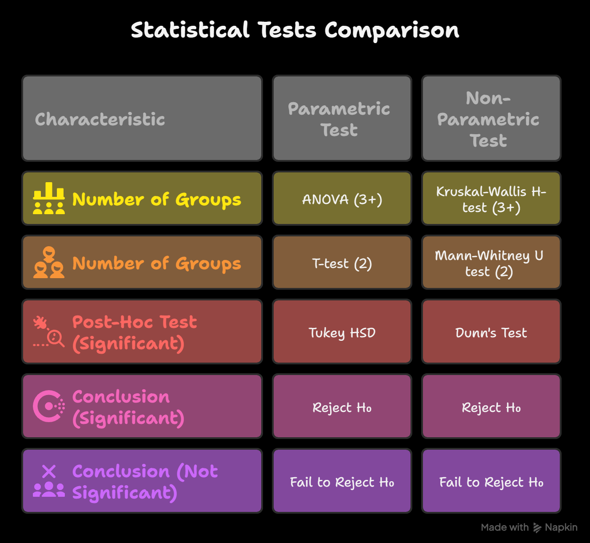
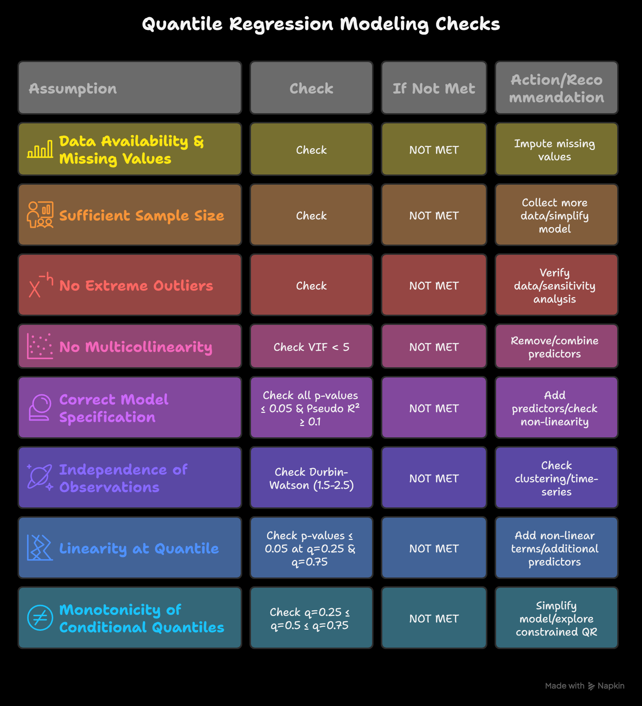
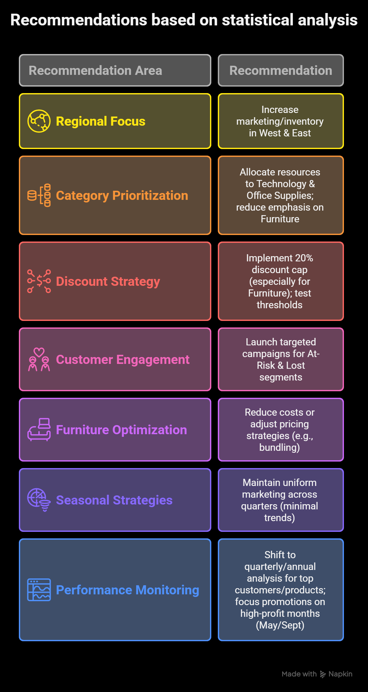
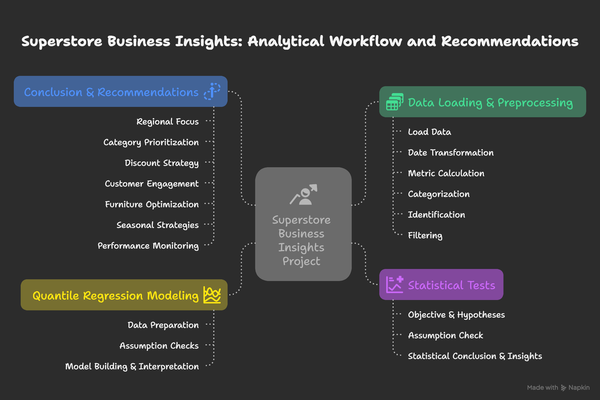

# Superstore-Dataset-Analysis
Analytical workflow for Superstore Business Insights: identifies key profitability drivers via statistical tests and quantile regression. Includes data cleaning, hypothesis testing, model checks, and actionable recommendations from SampleSuperstoreClean.csv.

# Superstore Business Insights: Analytical Workflow and Recommendations

## Overview
This project analyzes superstore sales data to uncover key drivers of profitability and provide actionable, evidence-based recommendations. Using the `SampleSuperstoreClean.csv` dataset, the workflow employs statistical hypothesis testing and quantile regression to examine factors like regions, categories, discounts, customer segments, and seasonal trends. The goal is to help superstore management optimize operations, marketing, and pricing strategies for improved profitability.

Key objectives:
- Identify profitability drivers across business areas (e.g., regional performance, discount impacts).
- Conduct rigorous statistical tests with assumption checks.
- Quantify median impacts using quantile regression.
- Synthesize insights into practical recommendations.

## Project Structure
- **Data/**: Contains the dataset (`SampleSuperstoreClean.csv` – not included here; source it from standard superstore sample data).
- **Notebooks/**: Jupyter notebooks or Python scripts for data preprocessing, statistical tests, and modeling.
- **Visuals/**: Mind maps and diagrams illustrating the workflow (see below).
- **Docs/**: Additional documentation, including the full analytical workflow PDF.

## Analytical Workflow
The project is divided into four phases:

### Phase 1: Data Loading & Preprocessing
- Load data from `SampleSuperstoreClean.csv`.
- Transform dates: Convert 'Order Date' to datetime, extract 'Order Month' and 'Order Quarter'.
- Calculate metrics: Profit Margin (Profit / Sales).
- Categorize: Create 'Discount Group' (e.g., 0-20%, 20-30%), RFM-based 'customer_segment' (e.g., High-Value, Loyal, At-Risk), and 'Group' (Furniture vs. Others).
- Identify: Top 10% customers and products by profit.
- Filter: Ensure minimum 20 observations per group for statistical validity.

### Phase 2: Key Findings - Statistical Tests
Repeated for key areas (Regional, Category, Discount, Customer, Furniture, Seasonal, Monthly):
- **Objective & Hypotheses**: Analyze business aspects; H₀: Equal distributions across groups; H₁: Distributions differ.
- **Assumption Checks**:
  - Normality: Shapiro-Wilk (n < 50) or D'Agostino K² (n ≥ 50).
  - Homogeneity: Levene's test.
- **If Assumptions Met**: Parametric tests (ANOVA for 3+ groups, T-test for 2 groups). If significant (p < 0.05), perform Tukey HSD post-hoc.
- **If Not Met**: Non-parametric tests (Kruskal-Wallis for 3+ groups, Mann-Whitney U for 2 groups). If significant, perform Dunn's post-hoc.
- **Insights**: State statistics, conclusions, rank groups by median, generate visualizations (box plots, bar charts, heatmaps), and derive business insights (e.g., West and East regions outperform others).

### Phase 3: Quantile Regression Modeling & Assumption Checks
For areas needing quantified median impacts:
- **Data Preparation**: Encode categoricals as dummies, define baselines.
- **Assumption Checks**:
  - Data availability (no missing values): Impute if needed.
  - Sufficient sample size: Collect more data or simplify if not.
  - No extreme outliers: Verify data or run sensitivity analysis.
  - No multicollinearity: VIF < 5; remove/combine predictors if exceeded.
  - Correct model specification: p-values ≤ 0.05 and Pseudo R² ≥ 0.1; add predictors or check non-linearity.
  - Independence: Durbin-Watson 1.5-2.5; check for clustering/time-series.
  - Linearity at quantiles: p-values ≤ 0.05 at q=0.25 and q=0.75; add non-linear terms.
  - Monotonicity: q=0.25 ≤ q=0.5 ≤ q=0.75; simplify or explore if not.
- **Modeling**: Fit median quantile regression (q=0.5) with robust standard errors. Interpret coefficients for business impact.

### Phase 4: Conclusion & Recommendations
- **Conclusion**: Synthesize robust findings (p < 0.0001) from tests and models.
- **Evidence-Based Recommendations**:
  - **Regional Focus**: Increase marketing/inventory in West & East.
  - **Category Prioritization**: Allocate resources to Technology & Office Supplies; reduce emphasis on Furniture.
  - **Discount Strategy**: Implement 20% discount cap (especially for Furniture); test thresholds.
  - **Customer Engagement**: Launch targeted campaigns for At-Risk & Lost segments.
  - **Furniture Optimization**: Reduce costs or adjust pricing (e.g., bundling).
  - **Seasonal Strategies**: Maintain uniform marketing across quarters (minimal trends).
  - **Performance Monitoring**: Shift to quarterly/annual analysis for top customers/products; focus promotions on high-profit months (May/Sept).

- **Model Limitations**:
  - Low explanatory power (Pseudo R² often < 0.01).
  - Linearity issues at specific quantiles.
  - Focus on trends, not precise predictions.
  - No multicollinearity; acceptable outliers.
  - Non-parametric tests validate group differences.

- **Proposed Improvements**:
  - Add predictors (e.g., store size, marketing spend).
  - Explore non-linear relationships (e.g., polynomial terms).
  - Apply scaling/transformations (e.g., log-transform, standardize).

## Technologies Used
- Python (Pandas, NumPy, SciPy, Statsmodels for stats; QuantReg for quantile regression).
- Visualizations: Matplotlib/Seaborn for plots; tools like Draw.io or similar for mind maps.

## Getting Started
1. Clone the repo: `git clone https://github.com/gaja-123/Superstore-Dataset-Analysis.git`
2. Install dependencies: `pip install -r requirements.txt` 
3. Run the notebooks: Execute each analysis notebook individually for targeted insights—e.g., Why West and East.ipynb, Why Cap Discounts at 20%.ipynb, Why Re-engage At-Risk and Lost Customers.ipynb, and others. Each file addresses a specific profitability lever.
   
## Contributing
Contributions welcome! Please fork and submit pull requests for improvements in code, documentation, or additional analyses.

## License
MIT License – feel free to use and adapt.

Made with ❤️ by [Gajarajan V Y]. Inspired by standard superstore datasets for educational purposes.
